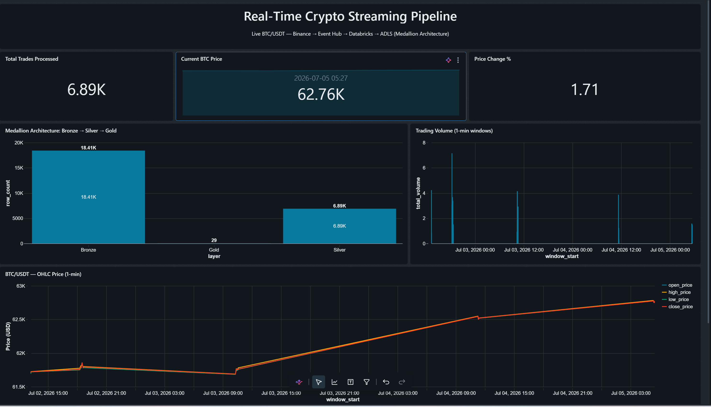
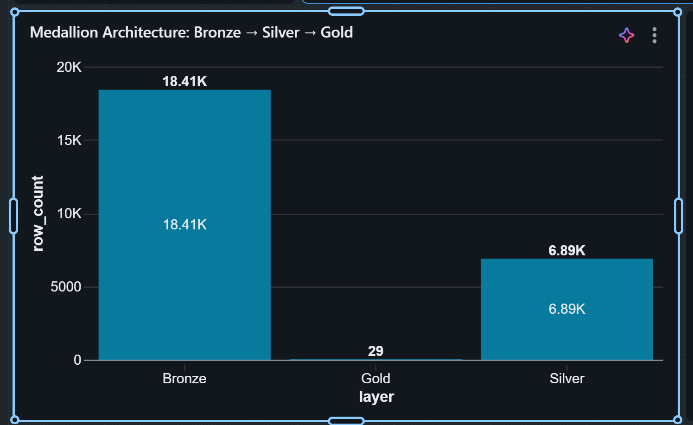
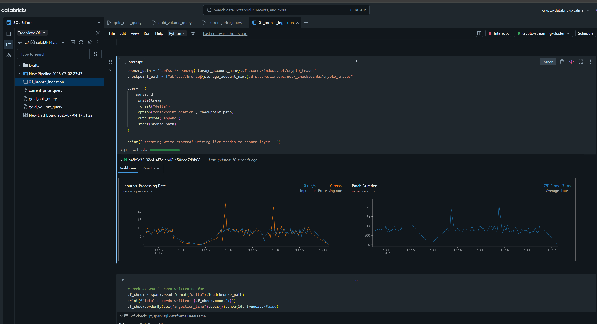

# Real-Time Crypto Streaming Pipeline on Azure

An end-to-end, real-time data engineering pipeline that streams live BTC/USDT trade data from Binance into Azure, processes it through a medallion architecture (Bronze → Silver → Gold) using Databricks, and visualizes it on a live dashboard.



---

##  Architecture

```
Binance WebSocket API
        │
        ▼
  Python Producer Script  (send_to_eventhub.py)
        │
        ▼
  Azure Event Hub  (Kafka-compatible endpoint)
        │
        ▼
  Databricks Structured Streaming  (bronze ingestion notebook)
        │
        ▼
  ADLS Gen2 — Bronze Layer  (raw Delta table)
        │
        ▼
  Spark Declarative Pipeline (SDP / DLT)
        │
        ├──▶ Silver Layer   (cleaned, deduplicated, typed)
        │
        └──▶ Gold Layer     (1-minute OHLC candles, volume, trade count)
        │
        ▼
  Databricks SQL Dashboard  (live visualization)
```

**Governance:** Unity Catalog manages access to ADLS via an Azure Access Connector + Storage Credential + External Location — no raw storage keys are used in pipeline code.

---

##  Tech Stack

| Layer | Technology |
|---|---|
| Data source | [Binance WebSocket API](https://binance-docs.github.io/apidocs/spot/en/#websocket-market-streams) (public, free, no auth) |
| Ingestion | Python (`websocket-client`) → Azure Event Hub (Kafka protocol) |
| Streaming compute | Azure Databricks (Structured Streaming + Spark Declarative Pipelines) |
| Storage | Azure Data Lake Storage Gen2 (Delta Lake format, medallion architecture) |
| Governance | Unity Catalog (External Locations, Storage Credentials, Secret Scopes) |
| Visualization | Databricks SQL Dashboard *(Power BI dashboard added separately — see below)* |
| Orchestration | Spark Declarative Pipelines (bronze → silver → gold as a single DAG) |

---

##  What the Pipeline Does

1. **Ingests** live BTC/USDT trades from Binance's public WebSocket feed
2. **Streams** each trade event into Azure Event Hub using the Kafka-compatible protocol
3. **Lands raw data** in the Bronze layer (ADLS, Delta format) via Spark Structured Streaming
4. **Cleans and deduplicates** trades in the Silver layer — correct data types, deduplication (Binance's feed sends duplicate ticks), null filtering
5. **Aggregates** Silver data into 1-minute OHLC (Open/High/Low/Close) candles, trading volume, and trade counts in the Gold layer
6. **Visualizes** the results on a live dashboard: price trend, volume, current price, and a data-quality view showing row counts shrink from Bronze → Silver → Gold as data is refined

---

##  Repository Structure

```
crypto-streaming-project/
├── test_binance.py            # Initial test script — prints live trades to console
├── send_to_eventhub.py        # Production ingestion script — streams trades to Event Hub
├── .env.example                # Template for required environment variables (no real secrets)
├── .gitignore
├── notebooks/
│   └── 01_bronze_ingestion.py # Databricks notebook: Event Hub → Bronze (Structured Streaming)
├── pipelines/
│   └── bronze_silver_gold.py  # Spark Declarative Pipeline: Bronze → Silver → Gold definitions
└── docs/
    └── dashboard_screenshot.png
```

---

##  Setup

### Prerequisites
- Azure subscription (Pay-As-You-Go; Free Trial subscriptions have compute quota restrictions that will block cluster creation)
- Python 3.9+
- Databricks workspace with Unity Catalog enabled

### 1. Clone and set up the local environment
```bash
git clone https://github.com/<your-username>/crypto-streaming-pipeline.git
cd crypto-streaming-pipeline
python -m venv venv
source venv/bin/activate   # or venv\Scripts\activate on Windows
pip install -r requirements.txt
```

### 2. Provision Azure resources
- Resource Group
- Event Hub Namespace (Standard tier, for Kafka protocol support) + Event Hub
- Storage Account with Hierarchical Namespace enabled (ADLS Gen2), containers: `bronze`, `silver`, `gold`
- Azure Databricks Workspace (Premium tier — Standard tier is no longer available for new workspaces as of April 2026)
- Access Connector for Azure Databricks, granted **Storage Blob Data Contributor** on the storage account

### 3. Configure Databricks
- Create a cluster (Dedicated/Single User access mode — required to install non-allowlisted Maven libraries under Unity Catalog)
- Install library: `org.apache.spark:spark-sql-kafka-0-10_2.13:<version matching your Spark version>`
- Create a Unity Catalog Storage Credential + External Location pointing at your ADLS containers
- Create a Secret Scope (`databricks secrets create-scope`) and store your Event Hub connection string

### 4. Run the pipeline
```bash
python send_to_eventhub.py
```
Then run `notebooks/01_bronze_ingestion.py` in Databricks, and trigger the `bronze_silver_gold.py` Spark Declarative Pipeline.

---


*Row counts shrinking from Bronze (18.4K raw events) → Silver (6.9K deduplicated trades) → Gold (29 one-minute OHLC candles) — visual proof the medallion architecture is genuinely refining data at each stage, not just relabeling it.*

##  Challenges & Lessons Learned

This project involved real, non-trivial troubleshooting — documenting it here because working through these issues *is* the learning:

- **VM quota limits on Free Trial subscriptions**: default compute quota is 0 for most VM families; required upgrading to Pay-As-You-Go to unlock quota.
- **Maven library restrictions on Unity Catalog Standard-mode clusters**: switched cluster to Dedicated (Single User) access mode to allow custom library installs.
- **Event Hub Spark connector incompatibility**: the native `azure-eventhubs-spark` connector doesn't support recent Spark versions. Solved by using Event Hub's Kafka-compatible endpoint with Spark's standard `spark-sql-kafka` connector instead — also a more transferable, industry-standard skill.
- **Streaming checkpoint vs. Event Hub retention**: resuming a paused stream after Event Hub's retention window passed caused `KafkaIllegalStateException`. Resolved with `failOnDataLoss=false`, which is standard practice for streaming sources with limited retention.
- **Raw storage keys blocked in serverless Declarative Pipelines**: Unity Catalog-governed serverless compute rejects direct storage-key Spark configs. Solved properly with an Access Connector + Storage Credential + External Location — the production-correct pattern, using Azure Managed Identity instead of static keys.

---

##  Cost Notes

Built and tested on Azure's $200 free credit. Approximate costs, kept low by:
- Auto-terminating the Databricks cluster after 30 minutes of inactivity
- Manually terminating compute during multi-hour breaks rather than relying on idle timers
- Using the smallest available VM size with available quota
- SQL Warehouse set to auto-stop after 10 minutes

---

##  Screenshots

**Live streaming ingestion (Databricks notebook, Event Hub → Bronze):**



**Full dashboard:** see top of this README.

**Medallion architecture row-count comparison:** see "Challenges & Lessons Learned" section above.

---

##  Future Improvements

- Add a `dlt.read_stream` incremental version of the Gold aggregation (currently a full batch recompute each run)
- Add sorted-window logic for more precisely accurate Open/Close values in OHLC candles
- Power BI dashboard with candlestick visualization for a more polished, non-technical-audience view
- Enable File Events on the External Location (requires additional IAM roles) for lower-latency, lower-cost ingestion at scale
- CI/CD via Databricks Asset Bundles

---

##  License

MIT
